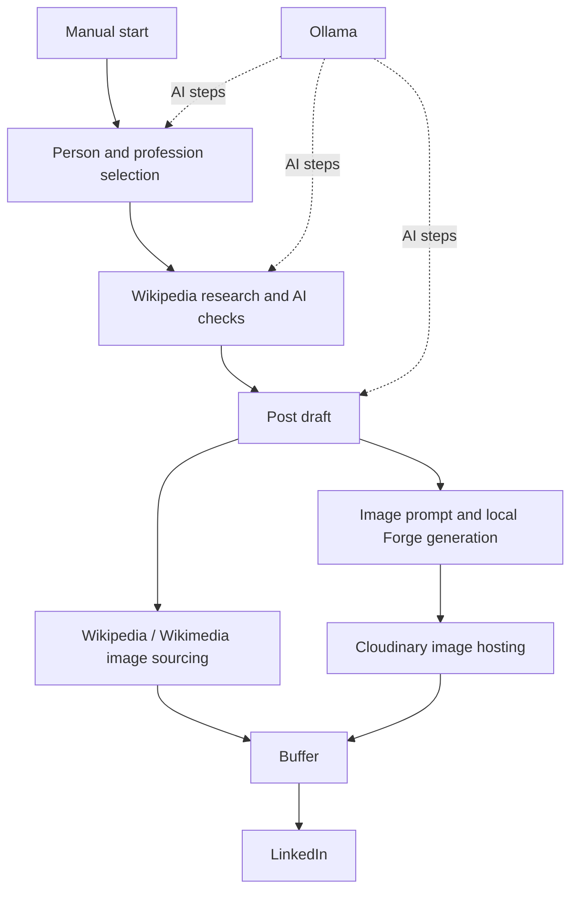

# HumanWeave

**An n8n project for turning stories about people and their work into AI-assisted LinkedIn content.**

HumanWeave brings research, writing, image sourcing, local image generation, and social publishing into one visual workflow. It combines local AI tools with cloud services to help move from a person and profession to a researched post with supporting visuals.

## Why I built it

I wanted to connect the different parts of content creation in one project: finding a person, checking information, writing a post, preparing images, and getting the result to LinkedIn. Building HumanWeave has been a hands-on way to learn automation, APIs, prompt design, and how local AI can work with cloud tools.

## How the workflow is organized

1. **Choose a topic.** An AI step proposes a profession, hobby, craft, sport, or specialist field, using Baserow records to help avoid repeats. Later research steps select a real person associated with it.
2. **Research and check the subject.** Wikipedia searches and biography information feed additional AI checks, including a person/profession relationship check. Conditional branches handle retries.
3. **Draft the post.** An AI writing step turns the research into content.
4. **Prepare visuals.** The workflow includes Wikipedia and Wikimedia Commons image searches, a portrait fallback search, and a branch for generating an illustrative image with Stable Diffusion WebUI Forge.
5. **Host generated images.** Cloudinary makes uploaded images available by URL for later steps.
6. **Pass content to Buffer for LinkedIn publishing.** Buffer provides the publishing connection that was difficult to establish directly.

This diagram summarizes the architecture; it is not an exact map of every node or branch.

## Tools and services used

| Tool or service | Role in HumanWeave |
| --- | --- |
| **n8n Cloud** | Main visual workflow builder and automation engine; connects the research, AI, image, storage, and publishing steps. |
| **Baserow** | Database and memory layer for storing workflow records and tracking previously selected subjects through row operations. |
| **Ollama** | Runs the language model used by the AI steps. |
| **Qwen3 8B (`qwen3:8b`)** | The language model configured for topic selection, research checks, post writing, and image-prompt creation. |
| **Wikipedia / MediaWiki API** | Subject searches, biography information, and image discovery. |
| **Wikimedia Commons** | Portrait and field-related image searches, including a fallback when a Wikipedia image is missing. |
| **Stable Diffusion WebUI Forge** | Runs local image generation and exposes the text-to-image API used by n8n. |
| **Stable Diffusion** | The image-generation technology behind the local Forge setup. |
| **Cloudflare Tunnel / cloudflared** | Connects the local Forge service to the cloud workflow. |
| **Cloudinary** | Uploads and hosts generated images so downstream services can access them by URL. |
| **Buffer** | Bridges the workflow to LinkedIn publishing. |
| **LinkedIn** | Intended destination for the posts. |
| **GitHub** | Hosts the project documentation and sanitized workflow export. |
| **OpenAI Codex** | Development and setup helper: assisted with configuration, troubleshooting, workflow integration, and repository preparation. |
| **Claude** | Prompt helper: assisted with writing and refining prompts. |

Codex and Claude were helpers during development; they are separate from the Ollama model connection shown in the workflow.

## My biggest challenge: posting to LinkedIn

My biggest challenge was that I could not post directly to LinkedIn because of the limitations I encountered with the direct integration. That made the final publishing step harder than expected, even after the research and content-generation pieces were in place.

**Buffer helped solve that problem.** Instead of relying on a direct n8n-to-LinkedIn connection, I used Buffer as the publishing bridge. This let me connect the content workflow to LinkedIn through another service.

That experience taught me that building an automation is also about working within the limits of each platform and finding a practical way to connect them.

## Other lessons from the build

- A cloud workflow cannot directly call a service running on a laptop's localhost; connecting n8n Cloud to Forge required a tunnel.
- A Wikipedia article does not always include a usable portrait, so image sourcing needs fallback handling and a check that the image depicts the right person.
- Generated images need an accessible URL before they can be used by downstream publishing services.
- AI checks can support research, but they do not guarantee accuracy. Facts, identity matches, and final copy still need review.
- API credentials and account-specific settings must be separated from a public workflow export.

## Project status

HumanWeave is a work in progress. The [32-node n8n workflow](HumanWeave.json) is available as a sanitized template, with credentials removed and account-specific settings replaced by placeholders. Follow the [setup guide](SETUP.md) after importing it into your own n8n instance. It requires configuration and has not been tested end to end as a fresh installation.

The portrait fallback branch is unfinished. The export also retains a fragile memory-field reference, conflicting writing-prompt instructions, and a retry loop without an enforced limit. These are documented in [Known limitations](SETUP.md#known-limitations); the original workflow logic has been preserved.

## Recreating the setup

A separate installation needs its own:

- n8n instance and Baserow tables for workflow records and memory.
- Ollama service and the chosen language model.
- Local Forge installation with an appropriate Stable Diffusion model and its API enabled.
- Protected connection from n8n Cloud to the local image-generation service.
- Cloudinary account and upload configuration.
- Buffer account, API access, and a connected LinkedIn destination.

Configure credentials in your own n8n installation. Review generated copy and images before enabling publishing steps. Check image licensing and attribution requirements, and clearly distinguish generated illustrations from authentic photographs.

## Acknowledgments

Built with assistance from **OpenAI Codex** for technical setup and development support, and **Claude** for prompt writing and refinement. Thanks to the maintainers and contributors behind n8n, Ollama, Stable Diffusion WebUI Forge, Wikipedia, Wikimedia Commons, and the other services that make the workflow possible.
